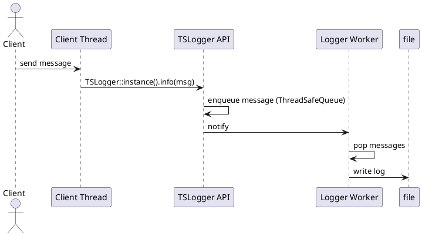
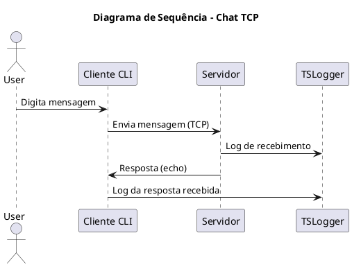

# README - Sistema Cliente/Servidor TCP com Logging Thread-Safe

## Descrição do Projeto

Sistema completo de comunicação cliente/servidor TCP implementado em C++, com biblioteca de logging thread-safe (`libtslog`) e suporte a múltiplos clientes concorrentes. O projeto demonstra o uso prático de conceitos de programação concorrente: threads, exclusão mútua, variáveis de condição, monitores e sockets.

## Estrutura do Projeto

```
.
├── include/
│   └── libtslog.h          # API da biblioteca de logging thread-safe
├── src/
│   ├── libtslog.cpp        # Implementação da libtslog
│   ├── server.cpp          # Servidor TCP concorrente
│   └── client.cpp          # Cliente TCP
├── tests/
│   ├── test_cli.cpp        # Teste de logging concorrente
│   ├── test_clients.sh     # Script de teste com múltiplos clientes
│   └── test_multiple.sh    # Script alternativo de teste
├── docs/
│   └── architecture.puml   # Diagramas de arquitetura (PlantUML)
├── Makefile                # Build com Make
├── CMakeLists.txt          # Build com CMake
└── README.md               # Este arquivo
```

## Funcionalidades Implementadas

### Biblioteca libtslog (v1-logging)

- Logger singleton thread-safe
- Fila de mensagens protegida por mutex e variáveis de condição
- Thread worker dedicada para escrita em arquivo
- Suporte a níveis de log: DEBUG, INFO, WARN, ERROR
- Timestamps automáticos com ID da thread
- Shutdown gracioso com flush de mensagens pendentes

### Sistema Cliente/Servidor (v2-cli e v3-final)

- **Servidor TCP:**
    - Aceita múltiplos clientes simultaneamente (porta 8080)
    - Thread dedicada por cliente
    - Echo de mensagens com logging completo
    - Gerenciamento automático de recursos (RAII)
- **Cliente TCP:**
    - Conexão ao servidor via socket
    - Envio de mensagens por linha de comando
    - Recepção e exibição de respostas
    - Logging de todas as operações

### Mecanismos de Concorrência

1. **Threads:** Uso de `std::thread` para:
    
    - Worker de logging assíncrono
    - Atendimento concorrente de clientes no servidor
2. **Exclusão Mútua:** `std::mutex` protegendo:
    
    - Fila de mensagens do logger
    - Arquivo de log durante escrita
3. **Variáveis de Condição:** `std::condition_variable` para:
    
    - Sincronização entre produtor (threads de log) e consumidor (worker)
    - Notificação de shutdown gracioso
4. **Monitores:** Classe `ThreadSafeQueue` encapsula sincronização
    
5. **Sockets:** API POSIX para comunicação TCP cliente/servidor
    
6. **RAII:** `std::unique_ptr` com deleters customizados para:
    
    - Fechamento automático de sockets
    - Gerenciamento seguro de recursos

## Como Compilar

### Opção 1: Makefile (Recomendado para Linux)

```bash
make
```

**Executáveis gerados:**

- `server` - Servidor TCP
- `client` - Cliente TCP
- `test_cli` - Teste de logging concorrente

**Limpar build:**

```bash
make clean
```

### Opção 2: CMake (Multiplataforma)

```bash
mkdir -p build && cd build
cmake ..
make
cd ..
```

**Executáveis gerados em:** `build/server`, `build/client`, `build/test_cli`

## Como Executar

### 1. Testar Biblioteca de Logging (v1-logging)

```bash
./test_cli [num_threads] [messages_per_thread]
```

**Exemplo:**

```bash
./test_cli 16 200
# Cria 16 threads, cada uma enviando 200 mensagens de log
# Resultado salvo em: test.log
```

**Verificações:**

- Arquivo `test.log` deve conter todas as mensagens (3200 linhas no exemplo)
- Formato: `YYYY-MM-DD HH:MM:SS [T<thread_id>] [INFO] worker X message Y`
- Nenhuma linha deve estar corrompida ou incompleta

### 2. Executar Sistema Cliente/Servidor (v2-cli e v3-final)

**Terminal 1 - Servidor:**

```bash
./server
# Aguarda conexões na porta 8080
# Logs salvos em: server.log
```

**Terminal 2 - Cliente único:**

```bash
./client "Olá, servidor!"
# Envia mensagem e exibe resposta
# Logs salvos em: client.log
```

**Teste com múltiplos clientes simultâneos:**

```bash
chmod +x tests/test_clients.sh
./tests/test_clients.sh
# Executa 5 clientes concorrentes
```

**Ou manualmente:**

```bash
./client "Cliente 1" &
./client "Cliente 2" &
./client "Cliente 3" &
wait
```

### 3. Análise de Logs

**Verificar logs do servidor:**

```bash
cat server.log
```

**Verificar logs dos clientes:**

```bash
cat client.log
```

**Verificar ordem temporal e IDs de threads:**

```bash
grep "\[T" server.log | sort
```

## Diagramas de Arquitetura

### Diagrama 1: Logging Thread-Safe



### Diagrama 2: Comunicação Cliente/Servidor



## Requisitos Atendidos

### Requisitos Funcionais

- [x] Threads para concorrência
- [x] Exclusão mútua com `std::mutex`
- [x] Variáveis de condição para sincronização
- [x] Monitores (classe `ThreadSafeQueue`)
- [x] Comunicação via sockets TCP
- [x] Gerenciamento de recursos com RAII
- [x] Tratamento de erros com exceções
- [x] Logging concorrente obrigatório

### Requisitos de Qualidade

- [x] Modularidade (biblioteca separada)
- [x] Smart pointers (`std::unique_ptr`)
- [x] Código limpo e documentado
- [x] Build funcional (Makefile e CMake)
- [x] Scripts de teste automatizado

### Requisitos de Documentação

- [x] README completo
- [x] Diagramas de sequência
- [x] Instruções de build e execução
- [x] Análise crítica com IA (ver seção abaixo)

## Testes de Concorrência

### Teste 1: Logging com Alta Concorrência

```bash
./test_cli 64 500
# 64 threads, 500 mensagens cada = 32.000 linhas
# Tempo esperado: < 5 segundos
```

**Verificação:**

```bash
wc -l test.log  # Deve mostrar exatamente 32000 linhas
```

### Teste 2: Múltiplos Clientes Simultâneos

```bash
for i in {1..20}; do ./client "Teste $i" & done; wait
```

**Verificação:**

```bash
grep "Novo cliente conectado" server.log | wc -l  # Deve mostrar 20
```

### Teste 3: Stress Test

```bash
# Terminal 1
./server

# Terminal 2
for i in {1..100}; do 
  ./client "Stress test $i" & 
done
wait
```

## Análise de Problemas de Concorrência

### Possíveis Race Conditions Mitigadas

1. **Acesso à fila de mensagens:**
    
    - **Problema:** Múltiplas threads enfileirando logs simultaneamente
    - **Solução:** `std::mutex` protegendo operações push/pop em `ThreadSafeQueue`
2. **Escrita no arquivo de log:**
    
    - **Problema:** Escrita concorrente causaria corrupção do arquivo
    - **Solução:** Thread worker único com mutex protegendo `ofstream`
3. **Lista de clientes conectados:**
    
    - **Problema:** Acesso concorrente à lista de sockets
    - **Solução:** Threads independentes (detached), sem compartilhamento de dados

### Ausência de Deadlocks

- **Análise:** Código não possui múltiplos locks encadeados
- **Verificação:** Cada operação crítica usa apenas um mutex por vez
- **Hierarquia de locks:** Não aplicável (apenas um lock por operação)

### Prevenção de Starvation

- **Fairness:** `std::mutex` garante competição justa entre threads
- **Fila FIFO:** `std::queue` processa mensagens em ordem de chegada
- **Sem prioridades:** Todas as threads têm igual chance de adquirir lock

## Melhorias Futuras (Opcionais)

- [ ] Autenticação de clientes com senha
- [ ] Mensagens privadas entre clientes
- [ ] Broadcast de mensagens para todos os clientes
- [ ] Interface gráfica (GUI)
- [ ] Criptografia TLS para comunicação segura
- [ ] Persistência de histórico de mensagens
- [ ] Limite configurável de clientes simultâneos
- [ ] Graceful shutdown do servidor com SIGINT

## Dependências

- **Compilador:** GCC 7+ ou Clang 6+ (suporte a C++17)
- **Sistema Operacional:** Linux (testado em Ubuntu 20.04+)
- **Bibliotecas:**
    - `pthread` (POSIX threads)
    - Sockets POSIX (arpa/inet.h)

**Nota:** Para Windows, ajustar includes de socket para Winsock2

## Autor

**Nome:** [Seu Nome]  
**Matrícula:** [Sua Matrícula]  
**Disciplina:** Programação Concorrente  
**Professor:** Bidu  
**Período:** 2025.1

## Repositório

**GitHub:** [URL do seu repositório]

### Tags de Versão

- `v1-logging` - Biblioteca libtslog + arquitetura
- `v2-cli` - Protótipo CLI funcional
- `v3-final` - Sistema completo

